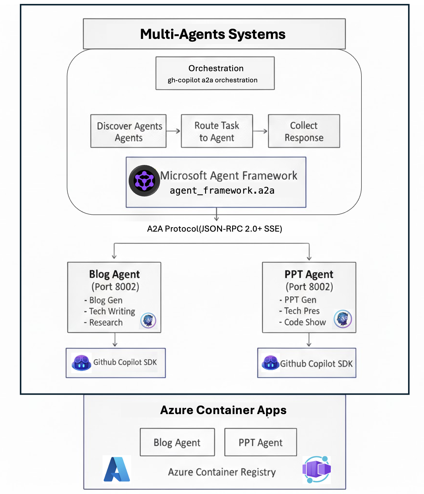
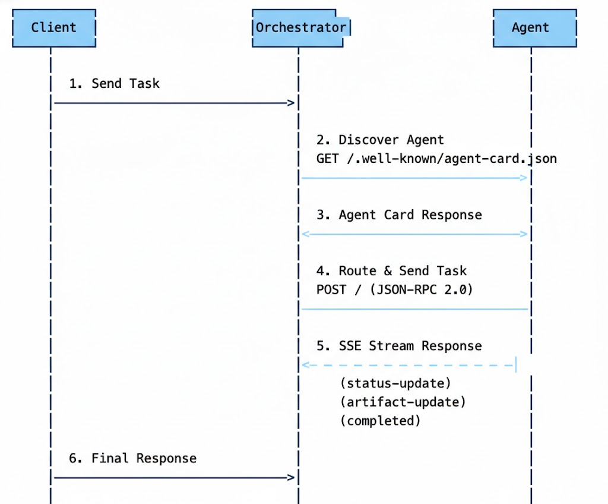

# Agents GitHub Copilot avec Protocole A2A

Un système multi-agent qui exploite le **SDK GitHub Copilot** et le **Protocole Agent-to-Agent (A2A)** pour l'orchestration intelligente des tâches. Ce projet démontre comment construire des agents IA spécialisés capables de communiquer et collaborer via le protocole A2A.

## Table des Matières

- [Aperçu du Projet](#aperçu-du-projet)
- [Architecture](#architecture)
- [Exigences d'Installation](#exigences-dinstallation)
- [Structure du Projet](#structure-du-projet)
- [Extraits de Code Techniques Clés](#extraits-de-code-techniques-clés)
- [Déploiement](#déploiement)
- [Ressources Associées](#ressources-associées)

---

## Aperçu du Projet

Ce projet implémente un **système d'orchestration multi-agent** avec les capacités suivantes :

- **Agent de Blog** : Génère des articles de blog techniques complets et bien recherchés en utilisant le SDK GitHub Copilot avec intégration DeepSearch
- **Agent PPT** : Crée des présentations professionnelles avec des exemples de code et du contenu technique
- **Orchestrateur** : Route intelligemment les tâches vers l'agent approprié en fonction des capacités et des mots-clés

### Fonctionnalités Clés

- 🤖 **Conformité au Protocole A2A** : Implémentation complète de la spécification du protocole Agent-to-Agent
- 🔄 **Routage Intelligent des Tâches** : Sélectionne automatiquement le meilleur agent en fonction du contenu de la tâche et des capacités de l'agent
- 📡 **Événements Envoyés par le Serveur (SSE)** : Réponses en streaming en temps réel pour les tâches de longue durée
- 🐳 **Prêt pour le Cloud-Native** : Agents conteneurisés déployables sur Azure Container Apps
- 🔐 **Configuration Sécurisée** : Gestion des secrets basée sur l'environnement

---

## Architecture



### Flux du Protocole A2A



---

## Exigences d'Installation

### Prérequis

- **Python** : 3.12+
- **Node.js** : 20+
- **Docker** : Pour le déploiement conteneurisé
- **Azure CLI** : Pour le déploiement sur Azure Container Apps
- **Git** : Pour le contrôle de version

### Dépendances Python

```bash
# Pour les Agents (Agent de Blog / Agent PPT)
pip install fastapi
pip install github-copilot-sdk
pip install python-dotenv
pip install uvicorn

# Pour l'Orchestrateur
pip install httpx
pip install python-dotenv
pip install a2a-sdk>=0.2.0
pip install agent-framework>=0.1.0
```

### Variables d'Environnement

Créez un fichier `.env` dans chaque répertoire de composant :

```bash
# Pour les Agents
COPILOT_GITHUB_TOKEN=votre_jeton_github_copilot
AGENT_PORT=8001  # ou 8002 pour l'Agent PPT

# Pour l'Orchestrateur
A2A_AGENT_HOST=https://blog-agent.example.com,https://ppt-agent.example.com
```

---

## Structure du Projet

```
GitHubCopilotAgents_A2A/
├── README.md
├── gh-copilot-multi-agents/           # Agents IA Individuels
│   ├── gh-cli-blog-agent/             # Agent de Génération de Blog
│   │   ├── main.py                    # Application FastAPI avec points de terminaison A2A
│   │   ├── requirements.txt           # Dépendances Python
│   │   ├── Dockerfile                 # Configuration du conteneur
│   │   ├── deploy-to-aca.sh          # Script de déploiement Azure Container Apps
│   │   ├── .copilot_skills/          # Définitions des compétences Copilot
│   │   │   └── blog/
│   │   │       └── SKILL.md          # Spécification des compétences de blog
│   │   └── blog/                      # Sorties de blog générées
│   │
│   └── gh-cli-ppt-agent/              # Agent de Génération PPT
│       ├── main.py                    # Application FastAPI avec points de terminaison A2A
│       ├── requirements.txt           # Dépendances Python
│       ├── Dockerfile                 # Configuration du conteneur
│       ├── deploy-to-aca.sh          # Script de déploiement Azure Container Apps
│       ├── .copilot_skills/          # Définitions des compétences Copilot
│       │   └── ppt/
│       │       └── SKILL.md          # Spécification des compétences PPT
│       └── ppt/                       # Sorties PPT générées
│
└── multi-agents-orchestrations/       # Couche d'Orchestration
    └── gh-copilot-a2a-orchestration/
        ├── main.py                    # Orchestrateur multi-agent avec routage automatique
        ├── requirements.txt           # Dépendances Python
        └── .env                       # Configuration (URLs des agents)
```

---

## Extraits de Code Techniques Clés

### 1. Point de Terminaison de Carte d'Agent A2A

Chaque agent expose ses capacités via un point de terminaison bien connu :

```python
@app.get("/.well-known/agent-card.json")
async def agent_card():
    """A2A Protocol: Agent Card endpoint for discovery"""
    return JSONResponse({
        "name": "blog_agent",
        "description": "Agent de génération de blog avec DeepSearch",
        "version": "1.0.0",
        "url": "https://your-agent-url.azurecontainerapps.io",
        "protocol": "a2a",
        "protocolVersion": "0.2.0",
        "defaultInputModes": ["text"],
        "defaultOutputModes": ["text"],
        "primaryKeywords": ["blog", "article", "write"],
        "skills": [
            {
                "id": "blog_generation",
                "name": "Génération de Blog",
                "description": "Générer des articles de blog techniques",
                "tags": ["blog", "writing"],
                "examples": ["Écrivez un blog sur le SDK GitHub Copilot"]
            }
        ],
        "capabilities": {
            "streaming": True,
            "pushNotifications": False
        }
    })
```

### 2. Gestionnaire de Réponse en Streaming SSE

Streaming en temps réel utilisant les Événements Envoyés par le Serveur :

```python
async def process_a2a_message_streaming(message_text: str, jsonrpc: str, 
                                        request_id: str, task_id: str, 
                                        context_id: str):
    """Traiter le message A2A et produire des événements SSE"""
    
    # Envoyer le statut de travail
    status_event = {
        "jsonrpc": jsonrpc,
        "id": request_id,
        "result": {
            "contextId": context_id,
            "taskId": task_id,
            "final": False,
            "status": {
                "state": "working",
                "message": {
                    "messageId": str(uuid.uuid4()),
                    "role": "agent",
                    "parts": [{"kind": "text", "text": "Traitement..."}]
                }
            },
            "kind": "status-update"
        }
    }
    yield f"data: {json.dumps(status_event)}\n\n"
    
    # Traiter avec le SDK GitHub Copilot
    session = await copilot_client.create_session({
        "model": "claude-sonnet-4.5",
        "streaming": True,
        "skill_directories": [SKILLS_DIR]
    })
    
    # ... exécution de la tâche ...
    
    # Envoyer l'événement de completion
    complete_event = {
        "jsonrpc": jsonrpc,
        "id": request_id,
        "result": {
            "contextId": context_id,
            "taskId": task_id,
            "final": True,
            "status": {"state": "completed"},
            "kind": "status-update"
        }
    }
    yield f"data: {json.dumps(complete_event)}\n\n"
```

### 3. Routeur de Tâches Intelligent

L'orchestrateur route les tâches en fonction des capacités des agents :

```python
@dataclass
class AgentInfo:
    """Informations sur l'agent avec capacités pour le routage"""
    agent: A2AAgent
    name: str
    primary_keywords: List[str]
    
    def matches_task(self, task: str, all_agents_keywords: Dict) -> float:
        """Calculer le score de pertinence pour le routage des tâches"""
        task_lower = task.lower()
        score = 0.0
        
        # Vérifier les mots-clés primaires (priorité la plus élevée)
        for keyword in self.primary_keywords:
            if keyword.lower() in task_lower:
                score += 0.5
        
        # Score négatif pour les mots-clés des autres agents
        for other_agent, other_keywords in all_agents_keywords.items():
            if other_agent != self.name:
                for keyword in other_keywords:
                    if keyword.lower() in task_lower:
                        score -= 0.3
        
        return max(0.0, min(score, 1.0))
```

### 4. Intégration du SDK GitHub Copilot

Utilisation du SDK Copilot pour la génération de contenu alimenté par IA :

```python
from copilot import CopilotClient
from copilot.generated.session_events import SessionEventType

# Initialiser le client
copilot_client = CopilotClient()
await copilot_client.start()

# Créer une session avec compétence
session = await copilot_client.create_session({
    "model": "claude-sonnet-4.5",
    "streaming": True,
    "skill_directories": ["/path/to/skills/SKILL.md"]
})

# Gérer la réponse en streaming
response_chunks = []
def handle_event(event):
    if event.type == SessionEventType.ASSISTANT_MESSAGE_DELTA:
        response_chunks.append(event.data.delta_content)

session.on(handle_event)
await session.send_and_wait({"prompt": task}, timeout=600)
```

---

## Déploiement

### Développement Local

```bash
# Démarrer l'Agent de Blog
cd gh-copilot-multi-agents/gh-cli-blog-agent
pip install -r requirements.txt
python main.py

# Démarrer l'Agent PPT (dans un autre terminal)
cd gh-copilot-multi-agents/gh-cli-ppt-agent
pip install -r requirements.txt
python main.py

# Démarrer l'Orchestrateur (dans un autre terminal)
cd multi-agents-orchestrations/gh-copilot-a2a-orchestration
pip install -r requirements.txt
python main.py
```

### Déployer sur Azure Container Apps

```bash
# Déployer l'Agent de Blog
cd gh-copilot-multi-agents/gh-cli-blog-agent
chmod +x deploy-to-aca.sh
./deploy-to-aca.sh

# Déployer l'Agent PPT
cd gh-copilot-multi-agents/gh-cli-ppt-agent
chmod +x deploy-to-aca.sh
./deploy-to-aca.sh
```

---

## Ressources Associées

### Documentation

- [Spécification du Protocole A2A](https://a2a-protocol.org/latest/) - Documentation officielle du protocole A2A
- [SDK GitHub Copilot](https://github.com/github/copilot-sdk) - SDK GitHub Copilot pour Python, Node.js, Go et .NET
- [Documentation FastAPI](https://fastapi.tiangolo.com/) - Framework web moderne pour construire des APIs

### Ressources Azure

- [Azure Container Apps](https://learn.microsoft.com/en-us/azure/container-apps/) - Hébergement de conteneurs serverless
- [Azure Container Registry](https://learn.microsoft.com/en-us/azure/container-registry/) - Registre de conteneurs Docker

### Projets Associés

- [Microsoft Agent Framework](https://github.com/microsoft/agent-framework) - Framework pour construire des agents IA
- [A2A SDK](https://pypi.org/project/a2a-sdk/) - SDK Python pour le protocole A2A

### Tutoriels

- [Construire des Systèmes Multi-Agent](https://github.com/kinfey/Multi-AI-Agents-Cloud-Native) - Dépôt parent avec plus d'exemples
- [Exécuter Copilot CLI dans Docker](https://gordonbeeming.com/blog/2025-10-03/taming-the-ai-my-paranoid-guide-to-running-copilot-cli-in-a-secure-docker-sandbox) - Guide de sandbox Docker sécurisé

---

## Licence

Ce projet fait partie du dépôt [Multi-AI-Agents-Cloud-Native](https://github.com/kinfey/Multi-AI-Agents-Cloud-Native).

## Auteur

**Kinfey Lo** - [GitHub](https://github.com/kinfey)
