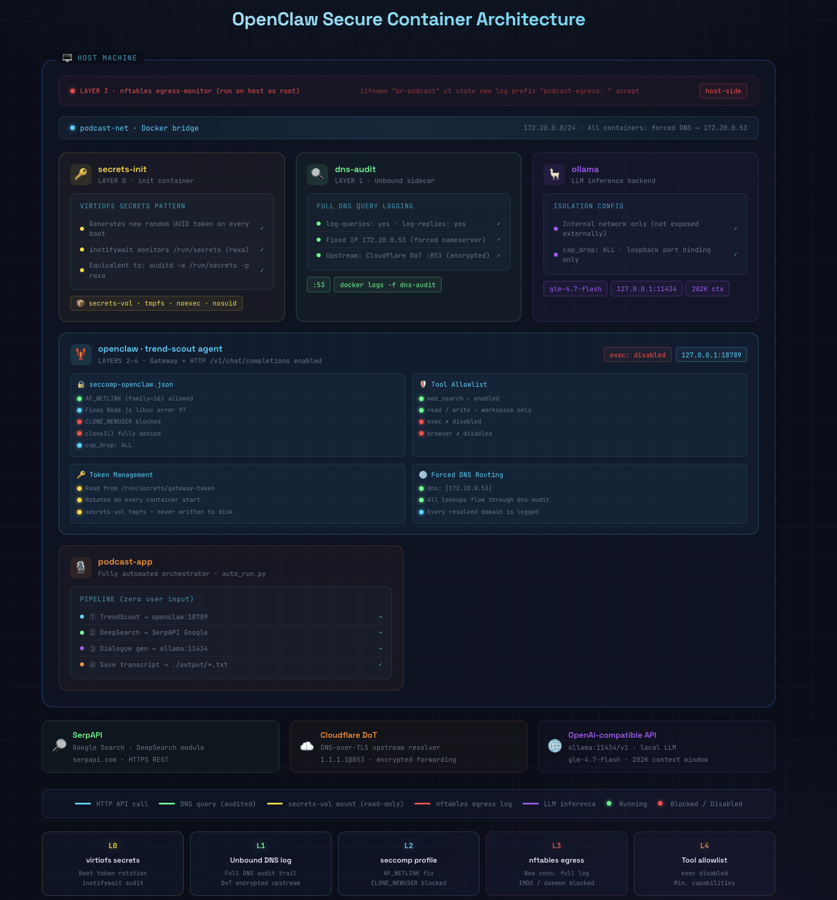

# Générateur de Podcast IA avec OpenClaw — Édition Sécurisée

> OpenClaw TrendScout x SerpAPI DeepSearch x Ollama

---



## Architecture de Sécurité (Défense en 5 Couches)

| Couche | Mécanisme | Description |
|--------|-----------|-------------|
| 0 | secrets-init | Rotation des jetons au démarrage, tmpfs secrets-vol, audit inotifywait |
| 1 | dns-audit | Sidecar Unbound, tout DNS journalisé, upstream Cloudflare DoT |
| 2 | seccomp | AF_NETLINK autorisé pour Node.js, CLONE_NEWUSER bloqué, cap_drop ALL |
| 3 | nftables egress | Journalisation egress au niveau hôte, Docker daemon + IMDS bloqués |
| 4 | Liste d'autorisation des outils | exec/browser désactivés dans openclaw.json |
| 5 | Contrôle d'écriture | tmpfs /tmp noexec, volume workspace scopé |

### Topologie des Conteneurs

```
┌─────────────────────────────────────────────────────────────┐
│  Hôte                                                        │
│  nftables: iifname "br-podcast" ct state new log           │
│            prefix "podcast-egress: " accept                 │
│                                                             │
│  ┌──────────────┐  ┌──────────────┐  ┌──────────────────┐  │
│  │ secrets-init │  │  dns-audit   │  │     openclaw     │  │
│  │ (Couche 0)   │  │  (Couche 1)  │  │   (Couches 2-5)  │  │
│  │              │  │              │  │                  │  │
│  │ régénérer    │  │ Unbound      │  │ seccomp          │  │
│  │ jeton au     │  │ log-queries  │  │ AF_NETLINK ✓     │  │
│  │ démarrage    │  │ =yes         │  │ CLONE_NEWUSER ✗  │  │
│  │ (rotation    │  │              │  │                  │  │
│  │  boot)       │  │ DNS: →       │  │ cap_drop ALL     │  │
│  │              │  │ Cloudflare   │  │ jeton depuis     │  │
│  │ inotifywait  │  │ DoT          │  │ fichier          │  │
│  │ /run/secrets │  │              │  │ exec désactivé   │  │
│  └──────┬───────┘  └──────┬───────┘  └────────┬─────────┘  │
│         │ secrets-vol     │ :53               │            │
│         └─────────────────┴───────────────────┘            │
│                      podcast-net (172.20.0.0/24)           │
└─────────────────────────────────────────────────────────────┘
```

---

## Mécanismes de Sécurité

### Couche 0 — secrets-init

- Le conteneur `secrets-init` génère un nouveau jeton aléatoire à chaque démarrage → écrit dans tmpfs `secrets-vol`
- `inotifywait` surveille tous les événements rwxa sur `/run/secrets`, journalise vers stdout
- `secrets-vol` utilise le driver `tmpfs` (`noexec,nosuid`), disparaît au redémarrage

### Couche 1 — dns-audit (Journalisation des requêtes DNS Unbound)

- Le conteneur `dns-audit` exécute Unbound avec IP fixe `172.20.0.53`
- Le conteneur OpenClaw `dns: [172.20.0.53]` force tout DNS à travers Unbound
- `log-queries: yes` + `log-replies: yes`, visible en temps réel via `docker logs -f dns-audit`
- Upstream utilise Cloudflare DoT (chiffré, résistant au MITM)

### Couche 2 — seccomp (Correction AF_NETLINK + blocage des espaces de noms)

> **Note** : Node.js appelle `os.networkInterfaces()` au démarrage via `uv_interface_addresses` de libuv, qui nécessite AF_NETLINK. Sans cela : "Unknown system error 97".

`security/seccomp-openclaw.json` :
```json
{
  "comment": "socket(): autoriser toutes les familles incluant AF_NETLINK(16), requis par Node.js libuv",
  "names": ["socket"],
  "action": "SCMP_ACT_ALLOW"
},
{
  "comment": "clone(): BLOQUER CLONE_NEWUSER(0x10000000) — défense contre l'évasion d'espace de noms",
  "names": ["clone"],
  "action": "SCMP_ACT_ALLOW",
  "args": [{ "index": 0, "value": 268435456, "op": "SCMP_CMP_MASKED_EQ", "valueTwo": 0 }]
},
{
  "comment": "clone3(): complètement bloqué",
  "names": ["clone3"],
  "action": "SCMP_ACT_ERRNO"
}
```

### Couche 3 — Journalisation egress nftables (hôte, installation manuelle requise)

`security/egress-monitor.sh` :
```bash
sudo bash security/egress-monitor.sh setup
# installe les règles nftables avec préfixe "podcast-egress: "
# bloque l'accès au daemon Docker (2376) et au cloud IMDS (169.254.169.254)

sudo bash security/egress-monitor.sh watch
# surveillance en direct, équivalent à journalctl grep
```

### Couche 4 — Liste d'autorisation des outils (exec désactivé)

```json
// config/openclaw.json
"tools": {
  "web_search": { "enabled": true },
  "read": { "enabled": true, "allowedPaths": ["/home/node/.openclaw/workspace", "/tmp"] },
  "write": { "enabled": true, "allowedPaths": ["/home/node/.openclaw/workspace", "/tmp"] },
  "exec": { "enabled": false },    // exécution shell désactivée
  "browser": { "enabled": false }  // contrôle navigateur désactivé
}
```

### Couche 5 — Contrôle des permissions d'écriture

- `read_only: false` (conteneur non défini en lecture seule)
- `tmpfs: /tmp:rw,noexec,nosuid` (répertoire temp en mémoire, pas d'exec)
- volume workspace monté séparément, portée d'écriture restreinte au niveau système de fichiers

---

## Démarrage Rapide

```bash
cp .env.example .env
vim .env  # remplir SERPAPI_KEY

chmod +x setup.sh && ./setup.sh
docker compose run --rm podcast-app
```

---

## Commandes de Surveillance

```bash
# Audit des requêtes DNS (tous les domaines résolus par OpenClaw)
docker logs -f dns-audit

# Audit d'accès au répertoire secrets
docker logs -f secrets-init

# Journal des connexions egress (installer d'abord)
sudo bash security/egress-monitor.sh setup
sudo bash security/egress-monitor.sh watch

# Voir les blocs seccomp (dmesg)
dmesg | grep "audit: type=1326"

# Logs de la passerelle OpenClaw
docker logs -f openclaw
```

---

## Structure des Fichiers

```
ai-podcast-v2/
├── docker-compose.yml        # Orchestration de services sécurisée en 5 couches
├── Dockerfile.app
├── .env.example
├── setup.sh
│
├── security/
│   ├── seccomp-openclaw.json # seccomp: correction AF_NETLINK + bloc CLONE_NEWUSER
│   ├── unbound.conf          # Config journalisation requêtes DNS Unbound
│   ├── secrets-init.sh       # Rotation boot virtiofs + auditd inotifywait
│   └── egress-monitor.sh     # Équivalent nftables microvm-egress (hôte)
│
├── config/
│   └── openclaw.json         # Liste d'autorisation outils + config agent
│
├── auto_run.py               # Point d'entrée orchestration entièrement automatisée
├── trend_scout.py            # Agent OpenClaw TrendScout
├── podcast_generator.py      # Génération dialogue LLM (jeton lu depuis fichier)
└── deepsearch.py             # SerpAPI DeepSearch
```

